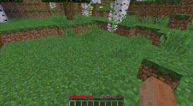
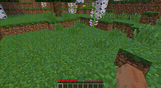
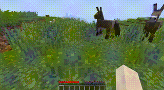
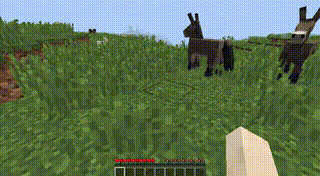
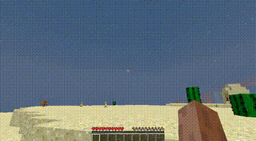

<p align="center">
  
</p>

<p align="center">
  <b>Open-source, reproducible training recipe for action-controllable Minecraft world models.</b>
</p>

<p align="center">
  <a href="#results">Results</a> •
  <a href="#quick-start">Quick Start</a> •
  <a href="#training-pipeline">Training</a> •
  <a href="#acknowledgements">Acknowledgements</a>
</p>

---

## About

ForgeWM is an open-source framework for training interactive world models that respond to keyboard and mouse inputs. We integrate existing open-source components — a pre-trained I2V backbone, community gameplay data, and a multi-stage distillation pipeline — into an end-to-end system that anyone can reproduce on 8 GPUs.

### Why does this exist?

The community has open model weights, open gameplay data, and open distillation methods — but no single project connects them into a working, reproducible pipeline for action-conditioned world models. ForgeWM fills that gap.

---

## Results

### ForgeWM (4-step DMD) vs Matrix-Game 2 (Self-Forcing Distillation)

Same reference frame, same action (walk forward). Left: MG2 official distilled model (Self-Forcing). Right: ForgeWM Stage 3 (Causal Forcing).

| Scene | Matrix-Game 2 | ForgeWM |
|-------|--------------|---------|
| Forest |  |  |
| Plains |  |  |
| Desert |  |  |

> Both use 4-step inference at 352×640. MG2 uses the official Self-Forcing distilled checkpoint; ForgeWM trains from scratch on GameFactory data with Causal Forcing.

---

## Comparison

| Project | Base Model | Control | Paradigm | I2V | Data Open | Train Code |
|---------|-----------|---------|----------|-----|-----------|------------|
| **ForgeWM** | Wan2.1-1.3B | Keyboard + Mouse | Causal Forcing | ✅ | ✅ GameFactory | ✅ |
| MG2 (Skywork) | Wan2.1-1.3B | Keyboard + Mouse | Self Forcing | ✅ | ❌ | ❌ (inference only) |
| minWM | HY1.5 / Wan2.1 | Camera pose | Causal Forcing | HY only | ✅ (camera data) | ✅ |
| HY-GameCraft | HunyuanVideo | Camera | Phased Consistency | ❌ | ❌ | Partial |

> minWM's HY15 line supports TI2V (text+image→video); the Wan2.1 line is T2V+camera only. Their open data is camera-trajectory based, not game-specific keyboard/mouse actions.

---

## Quick Start

### Prerequisites

```bash
pip install -r requirements.txt
```

### Inference (Single GPU)

```bash
CUDA_VISIBLE_DEVICES=0 python inference.py \
    --checkpoint_path ckpts/stage3/model.pt \
    --image_path demo_images/forest.png \
    --action_type forward \
    --num_frames 21 \
    --output_path output/demo.mp4
```

Supported actions: `forward`, `back`, `turn_right`, `turn_left`, `look_up`, `look_down`, `left`, `right`, `random`, `no_action`

---

## Training Pipeline

4-stage progressive distillation, each stage builds on the previous:

| Stage | Method | Time (8×H20) |
|-------|--------|--------------|
| 0 | Bidirectional SFT (domain adaptation) | ~10h |
| 1 | Teacher-Forcing Causal AR | ~30h |
| 2 | Consistency Distillation | ~18h |
| 3 | DMD (4-step real-time) | ~32h |

```bash
# Full pipeline
torchrun --nproc_per_node=8 train.py --config_path configs/stage0_bid_sft.yaml --logdir logs/stage0
torchrun --nproc_per_node=8 train.py --config_path configs/stage1_teacher_forcing.yaml --logdir logs/stage1
torchrun --nproc_per_node=8 train.py --config_path configs/stage2_consistency_distillation.yaml --logdir logs/stage2
torchrun --nproc_per_node=8 train.py --config_path configs/stage3_dmd.yaml --logdir logs/stage3
```

---

## Architecture

- **Keyboard (discrete)**: Cross-attention injection into each transformer block
- **Mouse (continuous)**: Concatenation with sliding-window grouping (VAE temporal compression ratio = 4)
- **History conditioning**: Channel-concat I2V + CLIP visual context
- **Long-video**: Block-wise causal attention + sliding window (local_attn_size=6)

---

## Roadmap

- ✅ 4-stage training pipeline (Bid SFT → TF AR → CD → DMD)
- ✅ Action-conditioned inference
- 🚧 Checkpoint release (HuggingFace)
- 🚧 Interactive real-time demo
- 🚧 Tech report

---

## Acknowledgements

ForgeWM integrates work from multiple research groups:

| Component | Source |
|-----------|--------|
| Base model | [Matrix-Game 2](https://github.com/skywork-ai/matrix-game) |
| Training data | [GameFactory](https://github.com/KlingAIResearch/GameFactory) |
| Distillation | [Causal Forcing](https://github.com/thu-ml/Causal-Forcing) |

We also thank the authors of:
- [Self-Forcing](https://github.com/guandeh17/Self-Forcing)
- [CausVid](https://github.com/tianweiy/CausVid)
- [Wan 2.1](https://github.com/Wan-Video/Wan2.1)
- [minWM](https://github.com/shengshu-ai/minWM)
- [GameCraft](https://github.com/Tencent-Hunyuan/Hunyuan-GameCraft-1.0)
- [HunyuanVideo](https://github.com/Tencent-Hunyuan/HunyuanVideo-1.5)

---

## Citation

```bibtex
@misc{forgewm2025,
  title={ForgeWM: A Reproducible Training Recipe for Action-Controllable World Models},
  author={ForgeWM Team},
  year={2025},
  url={https://github.com/asdfo123/ForgeWM}
}
```

---

## License

Apache License 2.0 — see [LICENSE](LICENSE).
