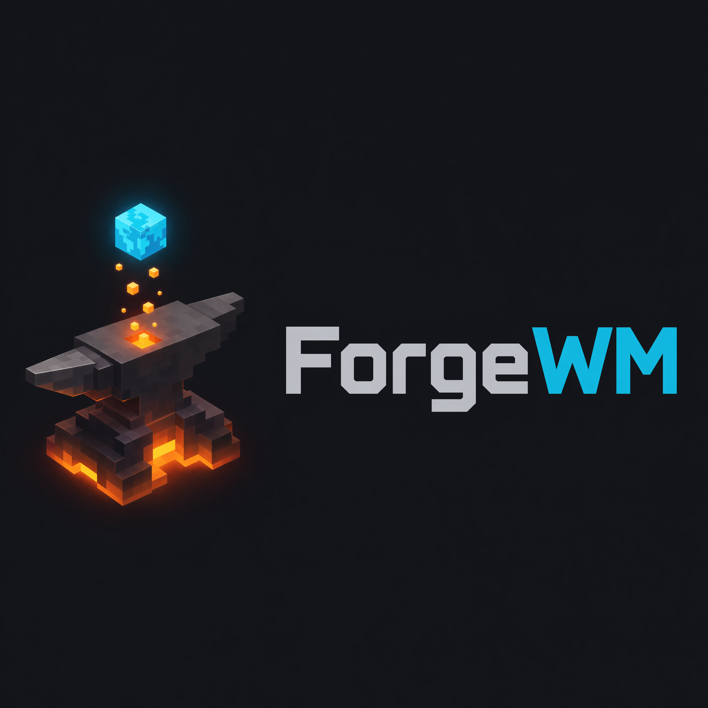
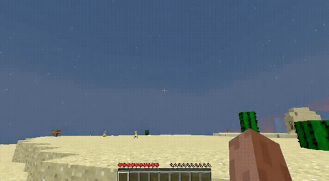
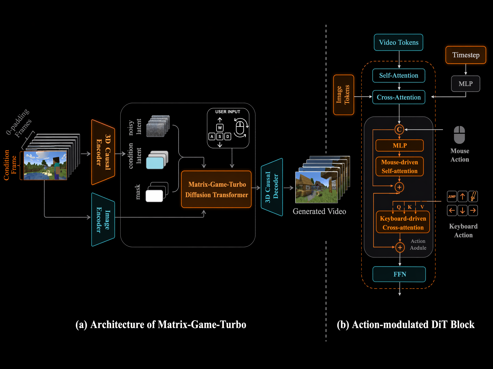

<p align="center">
  
</p>

<p align="center">
  <b>Train a real-time, playable Minecraft world model on 8 GPUs —  keyboard & mouse control, fully open and reproducible.</b>
</p>


<p align="center">
  
  
  
  <a href="https://asdfo123.github.io/ForgeWM/"></a>
  <a href="https://huggingface.co/asdfo123/ForgeWM"></a>
  <a href="https://huggingface.co/datasets/asdfo123/ForgeWM-data"></a>
  <a href="你的arXiv链接"></a>
  <a href="assets/wechat.JPG"></a>
</p>
<p align="center">
  <a href="https://asdfo123.github.io/ForgeWM/">Project Page</a> •
  <a href="#results">Results</a> •
  <a href="#quick-start">Quick Start</a> •
  <a href="#training-pipeline">Training</a> •
  <a href="#acknowledgements">Acknowledgements</a>
</p>

---

## About

ForgeWM is an open-source framework for training interactive world models that respond to keyboard and mouse inputs. We integrate [Matrix-Game 2](https://github.com/SkyworkAI/Matrix-Game)'s game-native I2V backbone, [GameFactory](https://github.com/KlingAIResearch/GameFactory)'s open Minecraft data, and the [Causal Forcing](https://github.com/thu-ml/Causal-Forcing) distillation pipeline into an end-to-end system reproducible on 8 GPUs.


### Why does this exist?

Matrix-Game 2 open-sourced the weights — but not the training data or the training code.

Causal Forcing (and Causal Forcing++) gave the community a strong distillation paradigm, and [minWM](https://github.com/shengshu-ai/minWM) provides an excellent open reference for it on camera-controlled video. But that line targets continuous camera trajectories on general T2V/TI2V backbones — not the discrete keyboard-and-mouse control that interactive games actually use.

ForgeWM fills the remaining gap: a fully open, end-to-end pipeline that brings Causal Forcing to discrete-action, game-native world models — built on the MG2 lineage, trained on open GameFactory data, reproducible on 8 GPUs.

---

## Results

### ForgeWM (4-step DMD) vs Matrix-Game 2 (Self-Forcing Distillation)

Same reference frame, same action. Left: MG2 official distilled model. Right: ForgeWM Stage 3.

| Scene | Matrix-Game 2 | ForgeWM |
|-------|--------------|---------|
| Forest (turn right) |  |  |
| Plains (forward) |  |  |
| Underwater Cave (forward) |  |  |
| Desert (back) |  |  |
| Rainy sunset (random) |  |  |
| Rainy night (forward) |  |  |

**Observations:**

- **Overall quality**: ForgeWM largely reproduces MG2's generation quality at 4-step inference. Temporal smoothness is slightly better; fine-grained texture detail is slightly weaker (likely due to smaller training data: GameFactory ~70h vs MG2's proprietary dataset).
- **"Underwater" artifact fixed**: MG2's original model tends to drift into underwater/ocean textures when encountering rain, blue sky, or dark scenes (rows 4–6) — likely caused by an over-representation of ocean footage in its proprietary training data. ForgeWM, trained on GameFactory's balanced action distribution, does not exhibit this failure mode.
- **Action controllability**: Both models respond correctly to keyboard/mouse inputs. ForgeWM's Causal Forcing distillation preserves action fidelity through all 4 stages.
- At the official 360p inference setting, we observed that MG2's HUD elements (e.g. the hotbar) gradually shrink over a rollout — a possible train/inference resolution mismatch. ForgeWM does not show this under our setting.


> Both models use 4-step inference at 352×640. MG2 uses the official Self-Forcing distilled checkpoint; ForgeWM trains from scratch on open GameFactory data with Causal Forcing.

---

## Comparison

| Project | Base Model | Control | Paradigm | I2V | Data Open | Train Code |
|---------|-----------|---------|----------|-----|-----------|------------|
| **ForgeWM** | Wan2.1-1.3B | Keyboard + Mouse | Causal Forcing | ✅ | ✅ GameFactory | ✅ |
| MG2 (Skywork) | Wan2.1-1.3B | Keyboard + Mouse | Self Forcing | ✅ | ❌ | ❌ (inference only) |
| minWM | HY1.5 / Wan2.1 | Camera pose | Causal Forcing | HY only | ✅ (camera data) | ✅ |

> minWM's HY15 line supports TI2V (text+image→video); the Wan2.1 line is T2V+camera only. Their open data is camera-trajectory based, not game-specific keyboard/mouse actions.

---

## Quick Start

### Prerequisites

```bash
pip install -r requirements.txt
pip install flash-attn --no-build-isolation
```

### Download Models & Data

```bash
# MG2 base model (~9 GB)
bash scripts/download_models.sh

# ForgeWM checkpoints (all 4 stages: stage0 / stage1 / stage2 / stage3)
huggingface-cli download asdfo123/ForgeWM --local-dir ./ckpts --repo-type model

# Training data (pre-encoded 360p LMDB, ~89 GB)
huggingface-cli download asdfo123/ForgeWM-data --local-dir ./data/action_lmdb --repo-type dataset
```

### Inference (Single GPU)

```bash
CUDA_VISIBLE_DEVICES=0 python inference.py \
    --checkpoint_path ckpts/stage3/model.pt \
    --image_path demo_images/forest.png \
    --action_type forward \
    --num_frames 21 \
    --output_path output/demo.mp4
```

Supported actions: `forward`, `back`, `turn_right`, `turn_left`, `look_up`, `look_down`, `left`, `right`, `random`, `no_action`

---

## Training Pipeline

4-stage progressive distillation, each stage builds on the previous:

| Stage | Method | Steps (8×H20) |
|-------|--------|--------------|
| 0 | Bidirectional SFT (domain adaptation) | 4000 |
| 1 | Teacher-Forcing Causal AR | 10000 |
| 2 | Consistency Distillation | 6000 |
| 3 | DMD (4-step real-time) | 2000 |

```bash
# Full pipeline
torchrun --nproc_per_node=8 train.py --config_path configs/stage0_bid_sft.yaml --logdir logs/stage0
torchrun --nproc_per_node=8 train.py --config_path configs/stage1_teacher_forcing.yaml --logdir logs/stage1
torchrun --nproc_per_node=8 train.py --config_path configs/stage2_consistency_distillation.yaml --logdir logs/stage2
torchrun --nproc_per_node=8 train.py --config_path configs/stage3_dmd.yaml --logdir logs/stage3
```

---

## Data Preparation

You can either download the pre-encoded LMDB directly, or build it yourself from the raw GameFactory dataset.

### Option A: Download pre-encoded data (recommended)

```bash
huggingface-cli download asdfo123/ForgeWM-data --local-dir ./data/action_lmdb --repo-type dataset
```

### Option B: Build from GF-Minecraft

Requires the [GameFactory](https://github.com/KlingAIResearch/GameFactory) GF-Minecraft dataset (~70h gameplay videos + action labels).

```bash
# 1. Download GF-Minecraft (see GameFactory repo for instructions)
#    Expected structure: data_2003/video/*.mp4 + data_2003/metadata/*.json

# 2. Encode into sharded LMDB (8 GPUs, ~2-3 hours)
GF_DATA=/path/to/GF-Minecraft/data_2003 bash scripts/prepare_data_all.sh
```

The script:
- Resizes videos to 352×640 (aspect-preserving crop)
- Encodes through Wan2.1 VAE → latent (21, 16, 44, 80) per clip
- Flips pitch sign (GF: +pitch = look-down → MG2: mouse[0] > 0 = look-up)
- Parses keyboard into 4-dim one-hot (W/S/A/D)
- Outputs 10 shards × 4000 clips = 40,000 training clips (~89 GB total)

---

## Architecture

<p align="center">
  
</p>

> Same Archtecture as Matrix-Game-2: The foundation model is derived from WanX. By removing the text branch and adding action modules, the model predicts next frames only from visual contents and corresponding actions.

### I2V Conditioning (First-Frame Fidelity)

Unlike T2V models that generate from text alone, ForgeWM uses a three-pathway image conditioning mechanism inherited from Matrix-Game 2:

1. **Channel-concat**: The first frame is VAE-encoded and concatenated channel-wise with the noise input (`cond_concat = [4-ch mask | 16-ch img_latent]`, 20 channels total). A binary mask marks frame 0 as "real" and subsequent frames as "to generate". This gives the model pixel-level reference for the opening frame.
2. **CLIP visual context**: The first frame is separately encoded through a CLIP vision encoder into a 257-token sequence, injected via cross-attention at every transformer block. This provides high-level semantic guidance (scene type, lighting, objects) that persists across the entire generation.
3. **Causal history**: During autoregressive rollout, previously generated (clean) frames are cached in the KV store.


### Action Injection

- **Keyboard (discrete)**: Cross-attention injection into each transformer block — keyboard actions are embedded and attend to latent frame tokens
- **Mouse (continuous)**: Concatenation with sliding-window grouping (VAE temporal compression ratio = 4) — continuous deltas are grouped per-frame and concatenated with latent features

### Temporal Architecture

- **Block-wise causal attention**: frames are grouped into chunks of `num_frame_per_block=3`; within a chunk, attention is bidirectional; across chunks, strictly causal
- **Sliding window** (`local_attn_size=6`): each chunk only attends to the 6 most recent frames, enabling unbounded-length generation at inference without memory growth

---

## Roadmap

### Released
- ✅ 4-stage training pipeline (Bid SFT → TF AR → CD → DMD)
- ✅ Action-conditioned inference
- ✅ All 4 stage checkpoints — Stage 0 / 1 / 2 / 3 ([HuggingFace](https://huggingface.co/asdfo123/ForgeWM))
- ✅ Pre-encoded training data ([HuggingFace](https://huggingface.co/datasets/asdfo123/ForgeWM-data))

### In progress
- 🚧 Interactive real-time demo
- 🚧 Tech report

### Future / community
- 💭 Multi-game support beyond Minecraft (FPS, racing, etc.)
- 💭 Larger backbones (Wan2.2-5B, HY1.5)
- 💭 Open to PRs & Collaboration.

---

## Acknowledgements

ForgeWM integrates work from multiple research groups:

| Component | Source |
|-----------|--------|
| Base model | [Matrix-Game 2](https://github.com/SkyworkAI/Matrix-Game) |
| Training data | [GameFactory](https://github.com/KlingAIResearch/GameFactory) |
| Distillation | [Causal Forcing](https://github.com/thu-ml/Causal-Forcing) |

We also thank the authors of:
- [Self-Forcing](https://github.com/guandeh17/Self-Forcing)
- [CausVid](https://github.com/tianweiy/CausVid)
- [Wan 2.1](https://github.com/Wan-Video/Wan2.1)
- [minWM](https://github.com/shengshu-ai/minWM)
- [GameCraft](https://github.com/Tencent-Hunyuan/Hunyuan-GameCraft-1.0)
- [HunyuanVideo](https://github.com/Tencent-Hunyuan/HunyuanVideo-1.5)

---

## Contact

- Email: leeasdfo123@gmail.com
- [WeChat Group](./assets/wechat.JPG)[](assets/wechat.JPG)

---

## Citation

```bibtex
@misc{forgewm2026,
  title={ForgeWM: A Reproducible Training Recipe for Action-Controllable World Models},
  author={ForgeWM Team},
  year={2026},
  url={https://github.com/asdfo123/ForgeWM}
}
```

---

## License

Apache License 2.0 — see [LICENSE](LICENSE).
