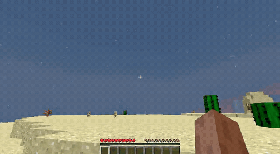
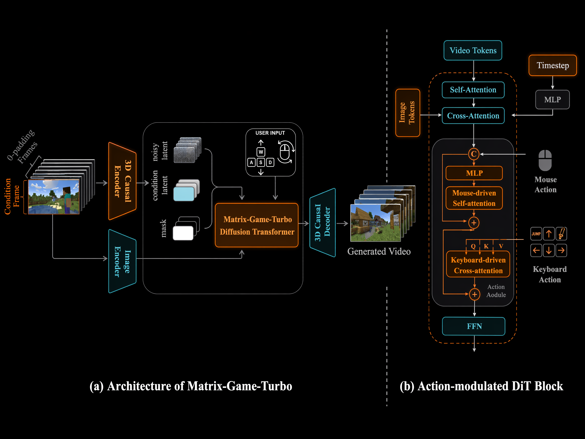

<p align="center">
  
</p>

<h3 align="center">ForgeWM: Progressive Causal Training for Few-Step Action-Conditioned Video World Models</h3>

<p align="center">
  A playable world model you drive with keyboard, mouse or a gamepad — in real time.
</p>


<p align="center">
  
  
  
  <a href="https://asdfo123.github.io/ForgeWM/"></a>
  <a href="https://huggingface.co/ForgeWM/ForgeWM"></a>
  <a href="https://huggingface.co/datasets/ForgeWM/ForgeWM-data"></a>
  <a href="https://arxiv.org/abs/2608.14022"></a>
  <a href="assets/wechat.JPG"></a>
</p>

<p align="center">
  <b>72 FPS</b> <sub>1-step, 352×640</sub> &nbsp;·&nbsp;
  <b>168 ms</b> <sub>per chunk</sub> &nbsp;·&nbsp;
  <b>1 / 2 / 4</b> <sub>step students</sub> &nbsp;·&nbsp;
  <b>8 GPUs</b> <sub>full recipe</sub>
</p>
<p align="center">
  <a href="https://asdfo123.github.io/ForgeWM/">Project Page</a> •
  <a href="#results">Results</a> •
  <a href="#quick-start">Quick Start</a> •
  <a href="#training-pipeline">Training</a> •
  <a href="#few-step-students-forgewm-1---2---4">Few-step</a> •
  <a href="#crossfps-porting-the-recipe-to-another-game-domain">CrossFPS</a> •
  <a href="#acknowledgements">Acknowledgements</a>
</p>

---

## About

ForgeWM is an open, end-to-end recipe for **few-step, action-conditioned video world models** — interactive generators that respond to discrete keyboard/mouse or gamepad input and roll out in real time. It brings the [Causal Forcing](https://github.com/thu-ml/Causal-Forcing) distillation paradigm to a game-native I2V backbone ([Matrix-Game 2](https://github.com/SkyworkAI/Matrix-Game)) trained on open data ([GameFactory](https://github.com/KlingAIResearch/GameFactory)), and is reproducible on 8 GPUs.

This repository accompanies the ForgeWM tech report and releases the full training code, checkpoints, and pre-encoded data.

- **Progressive causal pipeline** — four stages (bidirectional SFT → teacher-forced causal AR → consistency distillation → on-policy DMD) that take an MG2 base to a real-time interactive student.
- **Few-step students** — 1-, 2-, and 4-step models (ForgeWM-1 / -2 / -4) from one Stage-3 run per step budget, up to 72 FPS on a single H20.
- **Cross-domain transfer** — the same recipe ported to a gamepad-driven FPS (CrossFPS) by widening only the action interface.
- **Fully open** — weights, training code, and pre-encoded data all released.

---

## Results

### ForgeWM (4-step DMD) vs Matrix-Game 2 (Self-Forcing Distillation)

Same reference frame, same action. Left: MG2 official distilled model. Right: ForgeWM Stage 3.

| Scene | Matrix-Game 2 | ForgeWM |
|-------|--------------|---------|
| Forest (turn right) |  |  |
| Plains (forward) |  |  |
| Underwater Cave (forward) |  |  |
| Desert (back) |  |  |
| Rainy night (random) |  |  |
| Rainy sunset (forward) |  |  |

**Observations.** At matched 4-step inference (352×640), ForgeWM reproduces MG2's quality with slightly better temporal smoothness and slightly weaker fine texture (GameFactory ~70h vs MG2's larger proprietary set). Trained on GameFactory's balanced action distribution, it avoids two MG2 failure modes: drift into underwater/ocean textures on rain/dark scenes (rows 4–6), and HUD elements shrinking over a rollout. Action fidelity is preserved through all four stages.

> Both models use 4-step inference at 352×640. MG2 uses the official Self-Forcing distilled checkpoint; ForgeWM is trained on open GameFactory data with Causal Forcing.

---

## Comparison

| Project | Base Model | Control | Paradigm | I2V | Data Open | Train Code |
|---------|-----------|---------|----------|-----|-----------|------------|
| **ForgeWM** | Wan2.1-1.3B | Keyboard + Mouse | Causal Forcing | ✅ | ✅ GameFactory | ✅ |
| MG2 (Skywork) | Wan2.1-1.3B | Keyboard + Mouse | Self Forcing | ✅ | ❌ | ❌ (inference only) |
| minWM | HY1.5 / Wan2.1 | Camera pose | Causal Forcing | HY only | ✅ (camera data) | ✅ |

> minWM's HY15 line supports TI2V (text+image→video); the Wan2.1 line is T2V+camera only. Their open data is camera-trajectory based, not game-specific keyboard/mouse actions.

---

## Quick Start

### Prerequisites

```bash
pip install -r requirements.txt
pip install flash-attn --no-build-isolation
```

### Download Models & Data

```bash
# MG2 base model (~9 GB)
bash scripts/download_models.sh

# ForgeWM checkpoints (stage0-3 + 1step / 2step / crossfps)
huggingface-cli download ForgeWM/ForgeWM --local-dir ./ckpts --repo-type model

# Training data (pre-encoded 360p LMDB, ~89 GB)
huggingface-cli download ForgeWM/ForgeWM-data --local-dir ./data/action_lmdb --repo-type dataset
```

What that pulls down:

| Path | What it is |
|------|------------|
| `stage0/model.pt` | Stage 0 — bidirectional SFT, 4,000 updates. Also the frozen real denoiser (`teacher_ckpt`) Stage 3 scores against. |
| `stage1/model.pt` | Stage 1 — teacher-forced causal AR from the MG2 base, 20,000 updates at lr 2e-5 (sibling of Stage 0, not its child). |
| `stage2/model.pt` | Stage 2 — consistency distillation of Stage 1, 6,000 updates. |
| `stage3/model.pt` | Stage 3 — **ForgeWM-4**, the 4-step DMD student distilled from Stage 2. The default real-time model. |
| `1step/model.pt` | **ForgeWM-1** — 1-step student (shares Stage 0–2; first-chunk FFE schedule). |
| `2step/model.pt` | **ForgeWM-2** — 2-step student (shares Stage 0–2; first-chunk FFE schedule). |
| `crossfps/model.pt` | CrossFPS inference checkpoint — the same recipe on a gamepad FPS. A **separate lineage**, not a multi-domain model. |

The four Minecraft stages are a self-consistent chain: `stage3` (ForgeWM-4) is
distilled from `stage2`, which is distilled from `stage1`; `stage0` is the
frozen teacher Stage 3 scores against. Drop any of them into `./ckpts/` to
inspect a stage or reproduce the next one from the configs in this repo.

`stage3` is trained with an unconditional train-time KV-cache refresh
(`pipeline/self_forcing_training.py`) and a 6-frame sliding window; run it with
the config's `local_attn_size` / `sink_size` (the shipped `configs/stage3_dmd.yaml`
does this — see [Inference](#inference-single-gpu)).

### Inference (Single GPU)

```bash
# ForgeWM-4 (default). For the faster students, swap in
# configs/stage3_dmd_2step.yaml + ckpts/2step/model.pt (ForgeWM-2) or
# configs/stage3_dmd_1step.yaml + ckpts/1step/model.pt (ForgeWM-1).
CUDA_VISIBLE_DEVICES=0 python inference.py \
    --config_path configs/stage3_dmd.yaml \
    --checkpoint_path ckpts/stage3/model.pt \
    --image_path demo_images/forest.png \
    --action_type forward \
    --num_frames 21 \
    --output_path output/demo.mp4
```

`--local_attn_size` sets the sliding-window size: `6` is what Stage 3 was
trained with, `-1` is unbounded causal attention within the clip. Only Stage 3
pins a window (top-level config key); Stages 0–2 train at `-1`. The shipped
configs match the released checkpoints — override only to reproduce a specific
number.

`inference.py` carries two action palettes and picks one automatically from
`action_config.mouse_dim_in` in the config you pass:

- **Minecraft** (`mouse_dim_in: 2`, all `stage*` configs) — `forward`, `back`,
  `left`, `right`, `turn_right`, `turn_left`, `look_up`, `look_down`,
  `forward_turn_right`, `random`, `no_action`
- **CrossFPS** (`mouse_dim_in: 4`, all `crossfps_*` configs) — `idle`,
  `forward`, `back`, `strafe_left`, `strafe_right`, `look_left`, `look_right`,
  `look_up`, `look_down`, `fire`, `ads`, `jump`, `forward_fire`,
  `forward_look_right`, `random`, `no_action`
  (see [CrossFPS](#crossfps-porting-the-recipe-to-another-game-domain))

---

## Training Pipeline

Four stages. They are **not** a single chain — Stage 0 and Stage 1 are siblings
that both start from the MG2 base generator, and Stage 3 consumes *two*
checkpoints at once:

```
                    ┌──────────────────────────────────────────┐
                    │            MG2 base generator            │
                    └───────────────┬──────────────┬───────────┘
                                    │              │
              Stage 0  bidirectional SFT       Stage 1  teacher-forced causal
              (domain adaptation)                     │
                        │                        Stage 2  consistency distillation
                        │                             │
                        │  frozen, as the real        │  generator + critic init
                        │  denoiser  ẑ_real           │
                        └────────────┬────────────────┘
                                     ▼
                            Stage 3  on-policy DMD
                          (ForgeWM-1 / -2 / -4 students)
```

| Stage | Method | Init from | lr | Updates (8×H20) |
|-------|--------|-----------|-----|-----------------|
| 0 | Bidirectional SFT (domain adaptation) | MG2 base | 2e-6 | 4,000 |
| 1 | Teacher-forcing causal AR | MG2 base | 2e-5 | 20,000 |
| 2 | Consistency distillation (online, N=48 grid) | Stage 1 | 2e-6 | 6,000 |
| 3 | DMD self-rollout (real-time student) | Stage 2 + frozen Stage 0 | 2e-6 | 4,000 per student |

```bash
# Stage 0 and Stage 1 are independent — run them in either order, or in parallel
torchrun --nproc_per_node=8 train.py --config_path configs/stage0_bid_sft.yaml --logdir logs/stage0
torchrun --nproc_per_node=8 train.py --config_path configs/stage1_teacher_forcing.yaml --logdir logs/stage1

# Stage 2 continues from Stage 1
torchrun --nproc_per_node=8 train.py --config_path configs/stage2_consistency_distillation.yaml --logdir logs/stage2

# Stage 3 needs Stage 2 (generator) and Stage 0 (real denoiser)
torchrun --nproc_per_node=8 train.py --config_path configs/stage3_dmd.yaml --logdir logs/stage3
```

The stage configs read their inputs from `./ckpts/stage{0,1,2}/model.pt`. Point
them at your own run directories, or drop the released checkpoints there: the
published `stage0`/`stage1`/`stage2` are exactly the branch `stage3` (ForgeWM-4)
descends from, so they reproduce the released student.

Stages 0–2 train with unbounded causal attention inside the clip; only Stage 3
pins a 6-frame window (`local_attn_size: 6`, `sink_size: 0`). That asymmetry is
deliberate and is what the released files were trained with — see
[Inference](#inference-single-gpu).

---

## Few-step students (ForgeWM-1 / -2 / -4)

Stage 3 is run once **per step budget**. Each run is an independent 4,000-iteration
DMD job that differs only in its sampling schedule, so all three students share
Stage 0/1/2 and cost one Stage-3 run each:

| Student | `denoising_step_list` | `denoising_step_list_first_chunk` | Latency / chunk | Throughput |
|---------|----------------------|-----------------------------------|-----------------|------------|
| ForgeWM-4 | `[1000, 750, 500, 250]` | — | 369.6 ms | 32.5 FPS |
| ForgeWM-2 | `[1000, 250]` | `[1000, 750, 500, 250]` | 239.7 ms | 50.3 FPS |
| ForgeWM-1 | `[1000]` | `[1000, 750, 500, 250]` | 168.2 ms | 72.1 FPS |

> Single H20, 352×640, one 3-latent chunk (12 pixel frames) per step, VAE
> decode excluded, at the `local_attn_size: 6` the configs ship.

```bash
torchrun --nproc_per_node=8 train.py --config_path configs/stage3_dmd_2step.yaml --logdir logs/stage3_2step
torchrun --nproc_per_node=8 train.py --config_path configs/stage3_dmd_1step.yaml --logdir logs/stage3_1step
```

### First-Frame Enhancement (FFE)

Chunk 0 is conditioned purely on the reference frame and sets the visual anchor
for the whole rollout, so a 1-step chunk 0 blurs the entire clip.
`denoising_step_list_first_chunk` lets the 1- and 2-step students run the full
4-step schedule on chunk 0 and their budget-matched schedule everywhere else —
applied identically at training and inference. The idea follows
[ASD](https://arxiv.org/abs/2511.01419). The 4-step student leaves the key out
(as `configs/stage3_dmd.yaml` does).

---

## CrossFPS: porting the recipe to another game domain

The same four stages transfer to a completely different game family — a
gamepad-driven FPS — by changing only the action interface and the data. This
is a **separate checkpoint lineage**, not a multi-domain model.

Only the action interface changes:

| | Minecraft | CrossFPS |
|---|---|---|
| Continuous channel | 2-D mouse delta | 4-D dual analog sticks `[L.x, L.y, R.x, R.y]` |
| Discrete channel | 6 key flags (W/S/A/D/…) | 6 gamepad buttons (RT/LT/south/R3/west/north) |
| `action_config.mouse_dim_in` | 2 | 4 |

Widening `mouse_dim_in` grows the mouse-projection tensor, so it can't be copied
from the Minecraft checkpoint. Set `graft_mouse_mlp_weight: true` to keep the
1536 visual columns and re-seed only the new stick channels from the camera axes
(config default `[0, 1, 1, 0]`) — zero-init leaves the camera dead at this
learning rate. Stage 0 uses a 10× learning rate (2e-5); the graft happens once.

We release the CrossFPS Stage-3 checkpoint for inference. Inference reads the
action palette from the config:

```bash
CUDA_VISIBLE_DEVICES=0 python inference.py \
    --config_path configs/crossfps_stage3.yaml \
    --checkpoint_path ckpts/crossfps/model.pt \
    --image_path /path/to/your_own_fps_frame.png \
    --action_type forward_look_right \
    --output_path output/crossfps.mp4
```

> The CrossFPS training data comes from [SCOPE](https://z2tong.github.io/SCOPE).
> `configs/crossfps_*.yaml` expect an LMDB built with the same
> `scripts/prepare_data.py` schema at `./data/crossfps_lmdb`. `demo_images/`
> ships Minecraft frames only — point `--image_path` at a 352×640 frame of your
> own for the CrossFPS palette.

---

## Data Preparation

You can either download the pre-encoded LMDB directly, or build it yourself from the raw GameFactory dataset.

### Option A: Download pre-encoded data (recommended)

```bash
huggingface-cli download ForgeWM/ForgeWM-data --local-dir ./data/action_lmdb --repo-type dataset
```

### Option B: Build from GF-Minecraft

Requires the [GameFactory](https://github.com/KlingAIResearch/GameFactory) GF-Minecraft dataset (~70h gameplay videos + action labels).

```bash
# 1. Download GF-Minecraft (see GameFactory repo for instructions)
#    Expected structure: data_2003/video/*.mp4 + data_2003/metadata/*.json

# 2. Encode into sharded LMDB (8 GPUs, ~2-3 hours)
GF_DATA=/path/to/GF-Minecraft/data_2003 bash scripts/prepare_data_all.sh
```

The script:
- Resizes videos to 352×640 (aspect-preserving crop)
- Encodes through Wan2.1 VAE → latent (21, 16, 44, 80) per clip
- Flips pitch sign (GF: +pitch = look-down → MG2: mouse[0] > 0 = look-up)
- Parses keyboard into 4-dim one-hot (W/S/A/D)
- Outputs 10 shards × 4000 clips = 40,000 training clips (~89 GB total)

---

## Architecture

<p align="center">
  
</p>

> **Architecture is identical to [Matrix-Game 2](https://github.com/SkyworkAI/Matrix-Game)** — derived from WanX by removing the text branch and adding a hybrid action module (keyboard cross-attention + mouse channel concat). *Figure adapted from the Matrix-Game 2 paper.*

### I2V Conditioning (First-Frame Fidelity)

Unlike T2V models that generate from text alone, ForgeWM uses a three-pathway image conditioning mechanism inherited from Matrix-Game 2:

1. **Channel-concat**: The first frame is VAE-encoded and concatenated channel-wise with the noise input (`cond_concat = [4-ch mask | 16-ch img_latent]`, 20 channels total). A binary mask marks frame 0 as "real" and subsequent frames as "to generate". This gives the model pixel-level reference for the opening frame.
2. **CLIP visual context**: The first frame is separately encoded through a CLIP vision encoder into a 257-token sequence, injected via cross-attention at every transformer block. This provides high-level semantic guidance (scene type, lighting, objects) that persists across the entire generation.
3. **Causal history**: During autoregressive rollout, previously generated (clean) frames are cached in the KV store.


### Action Injection

- **Keyboard (discrete)**: Cross-attention injection into each transformer block — keyboard actions are embedded and attend to latent frame tokens
- **Mouse (continuous)**: Concatenation with sliding-window grouping (VAE temporal compression ratio = 4) — continuous deltas are grouped per-frame and concatenated with latent features

### Temporal Architecture

- **Block-wise causal attention**: frames are grouped into chunks of `num_frame_per_block=3`; within a chunk, attention is bidirectional; across chunks, strictly causal
- **Sliding window** (`local_attn_size=6`, Stage 3 only): each chunk only attends to the 6 most recent frames, enabling unbounded-length generation at inference without memory growth. Stages 0–2 leave it at `-1` (unbounded within the clip) — see [Inference](#inference-single-gpu)

---

## Roadmap

### Released
- ✅ 4-stage training pipeline (Bid SFT → TF AR → CD → DMD)
- ✅ Action-conditioned inference
- ✅ All four stage checkpoints — Stage 0 / 1 / 2 / 3 (ForgeWM-4) ([HuggingFace](https://huggingface.co/ForgeWM/ForgeWM))
- ✅ Few-step students — ForgeWM-1 / -2 checkpoints with First-Frame Enhancement
- ✅ CrossFPS inference checkpoint — the same recipe on a gamepad FPS domain
- ✅ Pre-encoded training data ([HuggingFace](https://huggingface.co/datasets/ForgeWM/ForgeWM-data))

### In progress
- 🚧 Interactive real-time demo
- 🚧 Tech report (arXiv)

### Future / community
- 💭 More game domains beyond Minecraft and FPS (racing, platformers, …)
- 💭 Larger backbones (Wan2.2-5B, HY1.5)
- 💭 Open to PRs & Collaboration.

---

## Acknowledgements

ForgeWM integrates work from multiple research groups:

| Component | Source |
|-----------|--------|
| Base model | [Matrix-Game 2](https://github.com/SkyworkAI/Matrix-Game) |
| Training data (Minecraft) | [GameFactory](https://github.com/KlingAIResearch/GameFactory) |
| Training data (CrossFPS) | [SCOPE](https://z2tong.github.io/SCOPE) |
| Distillation | [Causal Forcing](https://github.com/thu-ml/Causal-Forcing) |

We also thank the authors of:
- [Self-Forcing](https://github.com/guandeh17/Self-Forcing)
- [CausVid](https://github.com/tianweiy/CausVid)
- [Wan 2.1](https://github.com/Wan-Video/Wan2.1)
- [minWM](https://github.com/shengshu-ai/minWM)
- [GameCraft](https://github.com/Tencent-Hunyuan/Hunyuan-GameCraft-1.0)
- [HunyuanVideo](https://github.com/Tencent-Hunyuan/HunyuanVideo-1.5)

---

## Contact

- Email: xyli@se.cuhk.edu.hk
- [WeChat Group](./assets/wechat.JPG)[](assets/wechat.JPG)

---

## Citation

```bibtex
@misc{li2026forgewm,
  title={ForgeWM: Progressive Causal Training for Few-Step Action-Conditioned Video World Models},
  author={Xinye Li and Lingshuai Lin and Lei Wang and Liuzhou Zhang and
          Jialin Cui and Qingshan Li and Guanchu Wang and Qingbin Liu and
          Xi Chen and Jiang Bian and Wai Lam},
  year={2026},
  url={https://github.com/asdfo123/ForgeWM}
}
```

---

## License

Apache License 2.0 — see [LICENSE](LICENSE).

Parts of this repository are derived from other Apache-2.0 projects, and the
base weights and datasets it downloads carry their own terms. [NOTICE](NOTICE)
lists which directory came from where.
